# Basic Locators in Web

### CSS ID

//input[@id='value']

//input[@id='first-name']

### Class Name -

//button[@class='value']

//button[@class='btn btn-lg btn-danger']

### Name Attribute

//tagname[@Attribute='Value']

//input[@placeholder='Enter first name']

### Tag Name

Xpath =//tagname[@Attribute=value]

//input[@placeholder='Enter first name']

### Link Text

### Partial Link Text

### XPath(Absolute & Relative)

**Absolute XPath** - Absolute XPath is the way of identifying an element starting from the root of the DOM. The XPath expression starts with **“/” **symbol.
for example - ***/html/body/div/div/div/main/div/div/div/select**

**Relative XPath -** Relative XPath is the way of identifying an element by using its attributes for querying and can also be used for its nearest elements. Relative XPath doesn’t start with a root node; hence, this way of writing XPath is always reliable. The Path expression starts with “//”

for example - **//form/input[3]**

#### **Using Attributes**

//select[@id='select-menu']/option[@value='1']

### Logical Operators ( or & and)

https://formy-project.herokuapp.com/form

//input[@type='radio' and contains(text(), 'High School')]

//input[@type='checkbox' and contains(text(), 'Male')]

//a[@role='button' and contains(normalize-space(),'Submit')]

//div/text()[normalize-space()='Prefer not to say']

*//input[@type='checkbox' and contains(normalize-space(), '         Male       ')]*

*//input[@type='checkbox' and contains(normalize-space(),'         Prefer not to say       ')]*

//input[@type='checkbox' and contains(normalize-space(translate(text(), '', ''), '        Male       ')]

**//input[contains(normalize-space(text()), 'Male')]**

#### **XPath Using text() function**

//button[@type='button' and text()='Success']

//button[text()='Danger' and @type='button']

### XPath using contains() function:

//button[contains(text(), 'Danger') and @type='button']

[https://formy-project.herokuapp.com/dropdown]()

//div[@class='dropdown show']/div[@class='dropdown-menu show']/a[contains(normalize-space(.), 'Enabled and disabled')]

### XPath using starts-with() function

//input[starts-with(@id, 'first-n')]

### XPath using ends-with() function

//input[ends-with(@id, '-name')]
[https://formy-project.herokuapp.com/dropdown]()

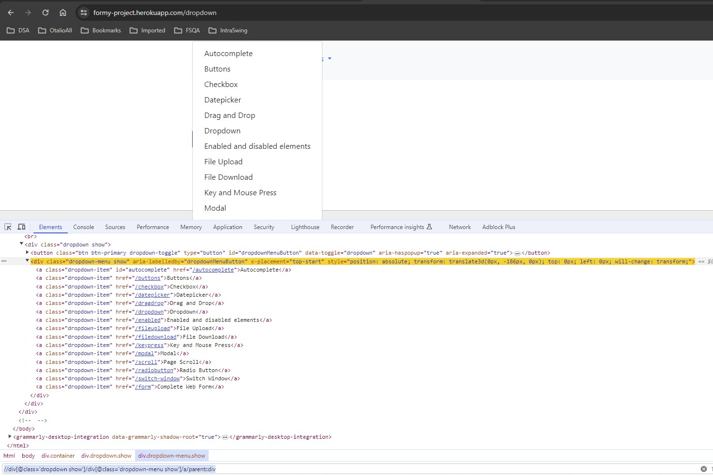

//div[@class='dropdown show']/div[@class='dropdown-menu show']/a[substring(text(), string-length(text()) - string-length('Upload') + 1) = 'Upload']

//div[@class='dropdown show']/div[@class='dropdown-menu show']/a[substring(text(), string-length(text()) - string-length('Download') + 1) = 'Download']

if text was id then use below -
//div[@class='dropdown show']/div[@class='dropdown-menu show']/a[substring(@id, string-length(@id) - string-length('Download') + 1) = 'Download']

**Explanation**

```
<!DOCTYPE html>
<html>
<body>
  <div id="item1">This is an example</div>
  <div id="item2">Another example text</div>
  <div id="item3">Different content</div>
  <div id="item4">Just an example</div>
</body>
</html>

```

###### *XPath to Select `<div>` Elements Ending with "example":*

//div[substring(text(), string-length(text()) - string-length('example') + 1) = 'example']

* `<div id="item1">This is an example</div>` and `<div id="item4">Just an example</div>`: These `<div>` elements will be selected because their text content ends with "example".
* `<div id="item2">Another example text</div>` and `<div id="item3">Different content</div>`: These `<div>` elements will not be selected because their text content does not end with "example".

### XPath using last() function

[https://formy-project.herokuapp.com/dropdown]()

//div[@class='dropdown show']/div[@class='dropdown-menu show']/a[last()]

### XPath using normalize-space()

//div[@class='dropdown show']/div[@class='dropdown-menu show']/a[last()]

### DATA TABLES Xpath

[https://www.cricbuzz.com/cricket-series/7607/indian-premier-league-2024/points-table]()

//table[@class="table cb-srs-pnts"]/tbody/tr/td//div[text()='Royal Challengers Bengaluru']

//table[@class="table cb-srs-pnts"]/tbody/tr/td//div[contains(text(),'Bengalur')]

//table[@class="table cb-srs-pnts"]/tbody/tr/td//div[contains(text(),'Bengaluru')]/../../../../td[8]

//table[@id="customers"]/tbody/tr/td/span[text()='Mexico']/../../td[last()]

//table[@id="customers"]/tbody/tr/td/span[last()]/../../td[last()]

[https://www.techlistic.com/2017/02/automate-demo-web-table-with-selenium.html]()

//table[@id="customers"]/tbody/tr/td/span[text()='Microsoft']/../../td[3]

//table[@id="customers"]/tbody/tr/td/span[text()='Mexico']/../../td[last()]

//table[@id="customers"]/tbody/tr/td/span[last()]/../../td[last()]

//table[@id="customers"]/tbody/tr[last()]/td[last()] - Best way

//div[@class='dropdown show']/div[@class='dropdown-menu show']/child::a

### Self: Selects the current node itself (`./`)

### Child: Selects child elements of the context node (`child::`)

Select all `<a>` child elements of a `<div>` element.

[https://formy-project.herokuapp.com/dropdown]()

//div[@class='dropdown show']/div[@class='dropdown-menu show']/child::a

### Parent: Selects the parent element of the context node (`parent::`)

[https://formy-project.herokuapp.com/dropdown]()

//div[@class='dropdown show']/div[@class='dropdown-menu show']/a/parent::div

### Ancestor: Selects all ancestor elements (parents, grandparents, etc.) of the context node (`ancestor::`)

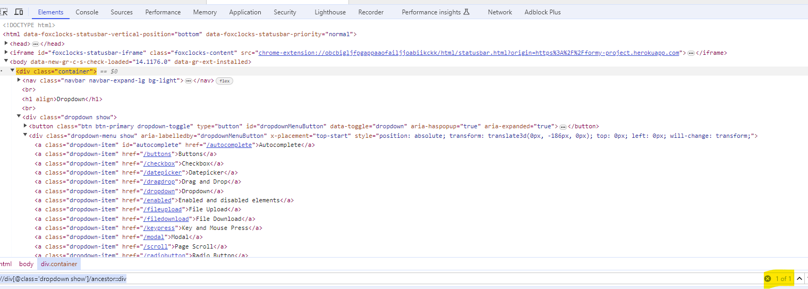

//div[@class='dropdown show']/ancestor::div

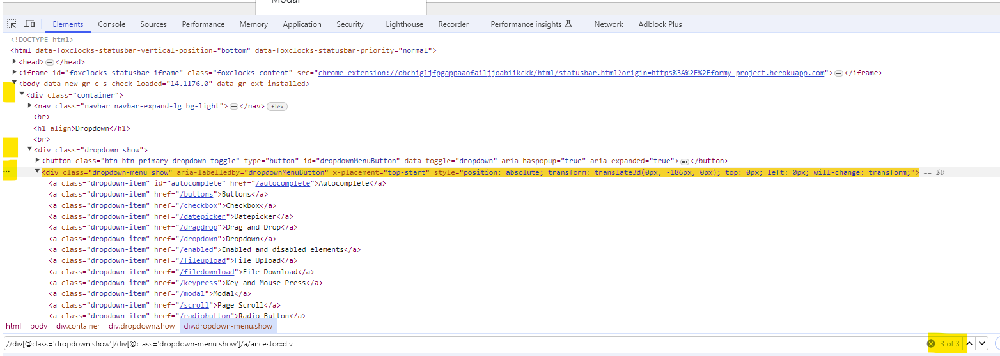

//div[@class='dropdown show']/div[@class='dropdown-menu show']/a/ancestor::div

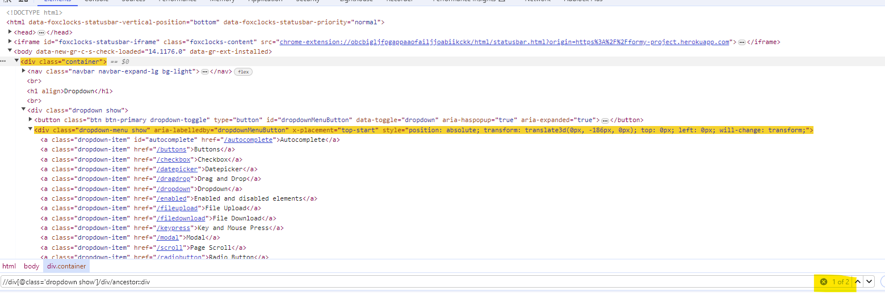

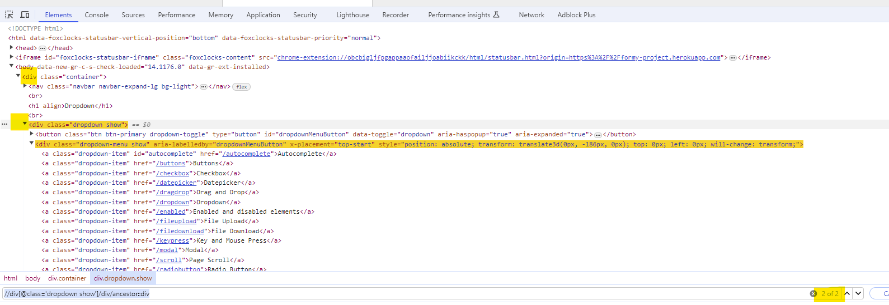

//div[@class='dropdown show']/div/ancestor::div

### Following-sibling: Selects the following sibling element of the context node (`following-sibling::`)

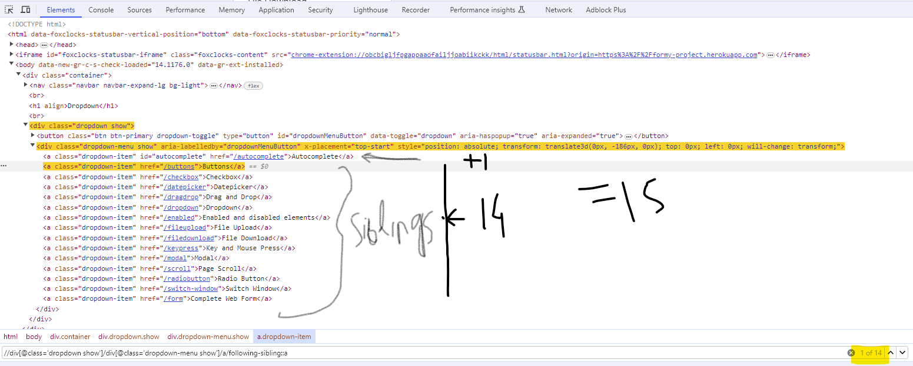

//div[@class='dropdown show']/div[@class='dropdown-menu show']/a/following-sibling::a

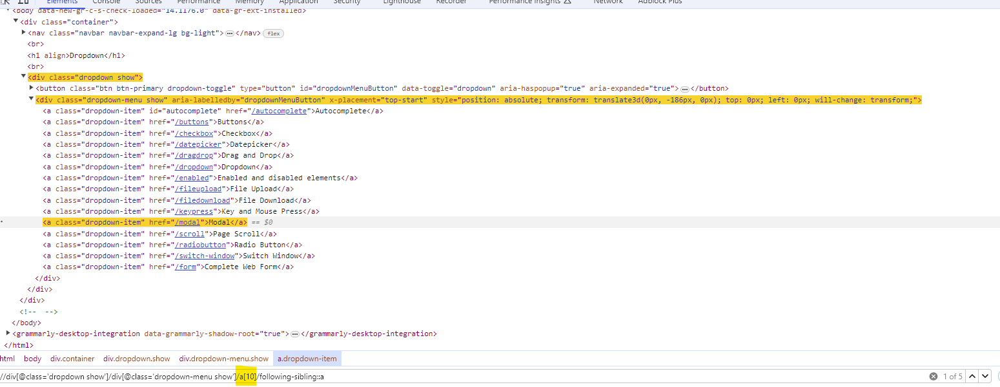

//div[@class='dropdown show']/div[@class='dropdown-menu show']/a[10]/following-sibling::a

### Preceding-sibling: Selects the preceding sibling element of the context node (`preceding-sibling::`)

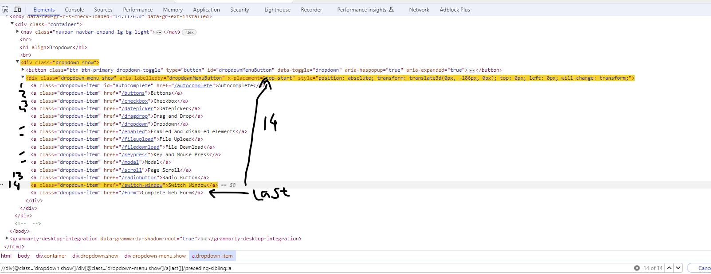

//div[@class='dropdown show']/div[@class='dropdown-menu show']/a[last()]/preceding-sibling::a

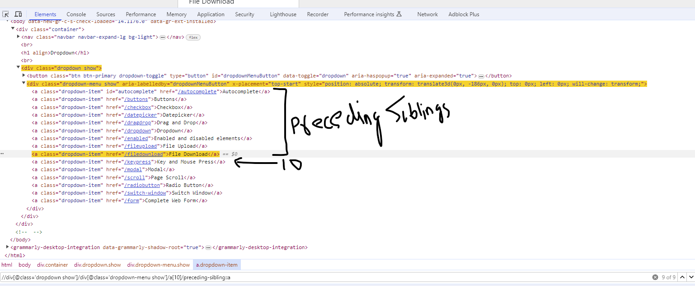

//div[@class='dropdown show']/div[@class='dropdown-menu show']/a[10]/preceding-sibling::a


**[https://formy-project.herokuapp.com/form]()**

### Descendant: Selects all descendant elements (children, grandchildren, etc.) of the context node (`descendant::`)

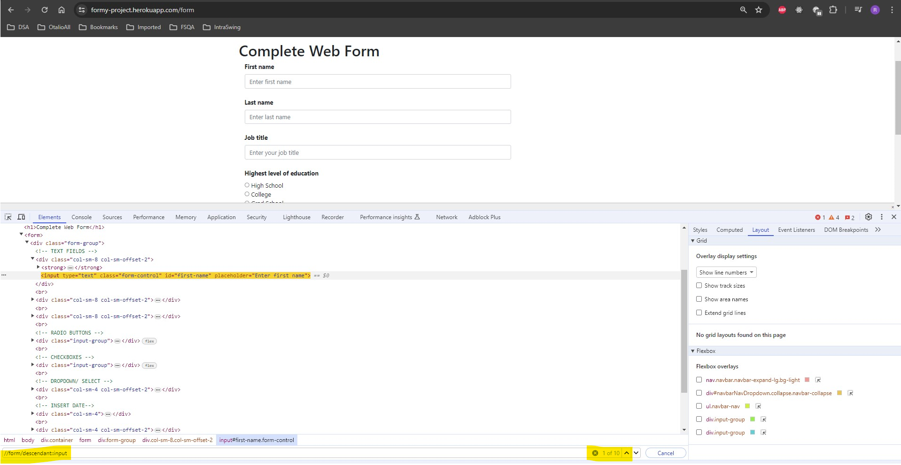

//form/descendant::input

### Following: Selects all following elements (siblings, children of siblings, etc.) of the context node (`following::`)


//body/following::*

### Preceding: Selects all preceding elements (siblings, parents of siblings, etc.) of the context node (`preceding::`)

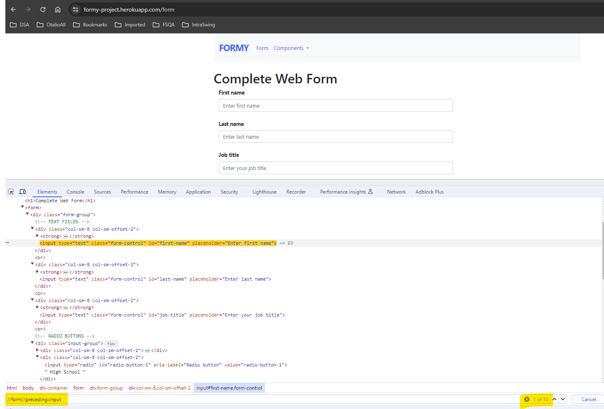

//form//preceding::input

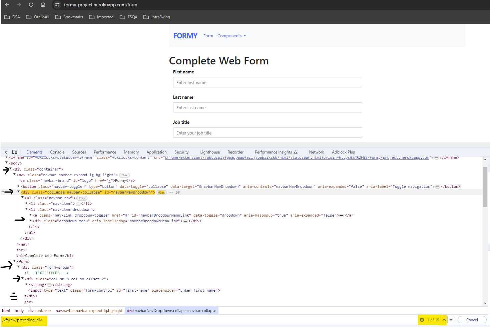

//form//preceding::div

//form//input/preceding::*

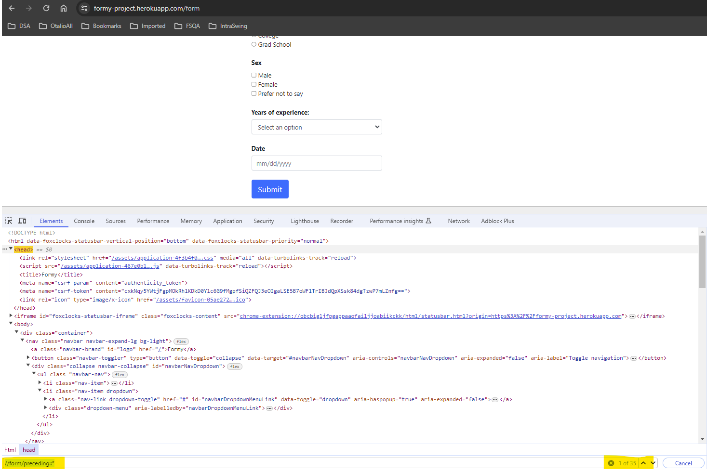

//form/preceding::*

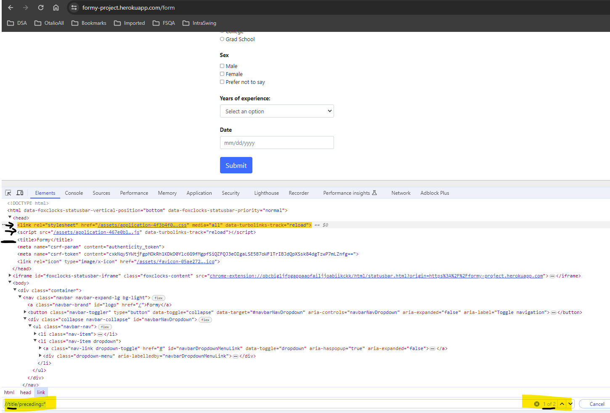

//title/preceding::*

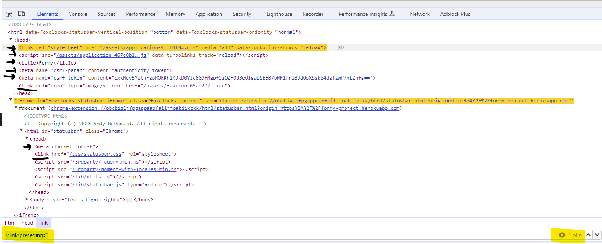

//link/preceding::*
